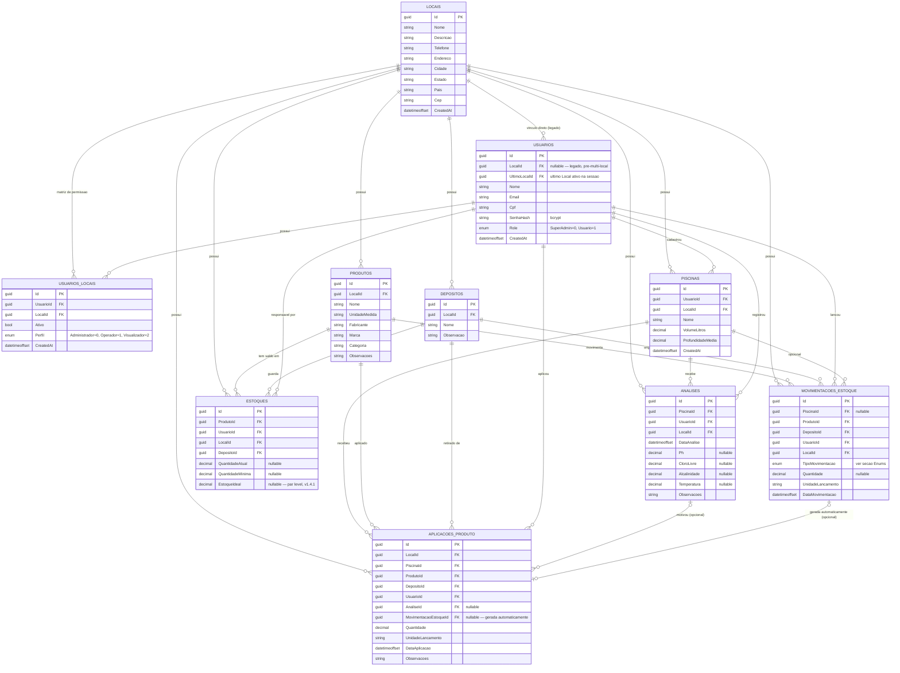

# DER — Diagrama de Entidade-Relacionamento

_Gerado a partir do código-fonte real (`PiscinaPerfeita.Api/src/Models`) em 19/07/2026 — reflete o schema em produção, não a proposta original em `Documentacao de contexto.md`._

## Diagrama



## Observações sobre o modelo

### Isolamento multi-tenant (`LocalId`)
Toda entidade que implementa `IBelongsToLocal` (`Piscina`, `Analise`, `Deposito`, `Produto`, `Estoque`, `MovimentacaoEstoque`, `AplicacaoProduto`) tem um **global query filter** aplicado automaticamente pelo EF Core em `PiscinaPerfeitaContext`:

```csharp
e => e.LocalId == CurrentLocalId || IsSuperAdminUser
```

Isso significa que **nenhuma query no código precisa filtrar por `LocalId` manualmente** — o próprio EF Core injeta essa condição em todo `SELECT` gerado pra qualquer uma dessas tabelas, usando o `local_id` do claim do JWT da requisição atual. Um `SuperAdmin` (enum `Role`, não `Perfil`) ignora esse filtro e enxerga todos os Locais. Isso explica o `WHERE e.localid = @ef_filter__CurrentLocalId OR @ef_filter__IsSuperAdminUser2` que aparece em todo log de query do Postgres.

### Dois níveis de papel/permissão distintos
- **`Role`** (em `Usuarios`, valores `SuperAdmin`/`Usuario`) — é o nível **global** do sistema. Só existe pra decidir quem enxerga todos os Locais.
- **`Perfil`** (em `UsuariosLocais`, valores `Administrador`/`Operador`/`Visualizador`) — é o nível de permissão **dentro de um Local específico**. Um mesmo usuário pode ser `Administrador` no Local A e `Visualizador` no Local B, através de registros distintos em `UsuariosLocais`.

### `Usuarios.LocalId` é legado
O campo `LocalId` direto em `Usuarios` é anterior à introdução de `UsuariosLocais` (que permite um usuário pertencer a múltiplos Locais). Hoje o vínculo de verdade é via `UsuariosLocais`; `UltimoLocalId` guarda qual Local o usuário tinha selecionado na última sessão (pra já abrir nele da próxima vez).

### `MovimentacoesEstoque` é o histórico central
Toda alteração de saldo em `Estoques` passa por um registro em `MovimentacoesEstoque`. O enum `Tipo` define o sinal da operação (ver tabela abaixo) — a lógica de soma/subtração vive no `MovimentacaoRepository`, não no banco.

| Tipo | Valor | Efeito no `QuantidadeAtual` |
|---|---|---|
| `Entrada` | 0 | soma |
| `Saida` | 1 | subtrai |
| `Compra` | 2 | soma |
| `Aplicacao` | 3 | subtrai |
| `Perda` | 4 | subtrai |
| `Descarte` | 5 | subtrai |
| `AjusteInventario` | 6 | soma a diferença (pode ser negativa) |

⚠️ Os valores numéricos de `Entrada`/`Saida` (0/1) são os originais gravados no banco e **não podem ser renumerados** — tipos novos sempre entram no final do enum.

### `AplicacaoProduto` → gera `MovimentacaoEstoque` automaticamente
Ao registrar uma aplicação de produto numa piscina, o `AplicacaoProdutoService` cria também uma `MovimentacaoEstoque` (tipo `Aplicacao`) pra dar baixa no `Estoque` do Depósito de onde saiu — o vínculo fica registrado em `AplicacaoProduto.MovimentacaoEstoqueId`. Uma aplicação pode opcionalmente estar ligada a uma `Analise` que a motivou (ex: pH baixo → aplicação de elevador de pH).

### Campos nullable por design
`Estoque.QuantidadeAtual/QuantidadeMinima/EstoqueIdeal` e `MovimentacaoEstoque.Quantidade` são todos nullable — o sistema aceita cadastro incompleto (ex: um produto cadastrado sem saldo inicial ainda contado). O front trata `null` como "não informado", não como zero.
