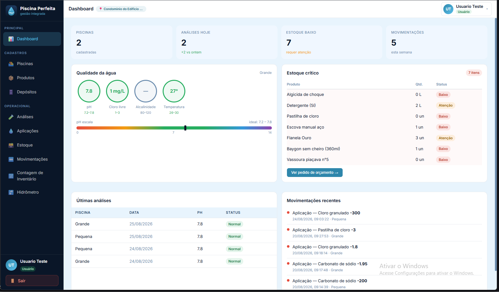
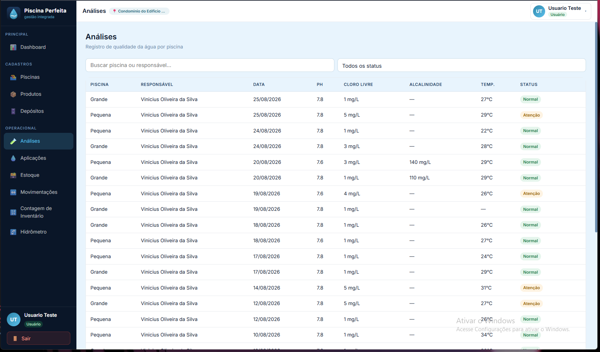

# 🏊 Piscina Perfeita

Sistema de gestão para empresas e condomínios que administram piscinas — controle de estoque de produtos químicos e de limpeza, análises de água, aplicação de produtos e histórico completo de movimentação, com isolamento **multi-tenant** entre clientes (Locais).

Projeto pessoal desenvolvido do zero para praticar arquitetura full stack em condições próximas de produção: autenticação, autorização por papéis, isolamento de dados entre tenants, deploy em nuvem e documentação técnica real.

🔗 **Demo online:** [link do deploy] — usuário `demo@...` / senha `...` (conta somente leitura)

   

---

## 🖼️ Screenshots

| Dashboard                                      | Controle de estoque                        | Análise de água                            |
| ---------------------------------------------- | ------------------------------------------ | ------------------------------------------ |
|  |  |  |

## ✨ Funcionalidades

**Multi-tenant & segurança**

- Isolamento total por Local — cada condomínio/cliente enxerga só os próprios dados.
- Controle de permissão por papel (`Administrador` / `Operador` / `Visualizador`).
- Autenticação via JWT + BCrypt.

**Estoque**

- Par level por produto — quantidade mínima e ideal por depósito, com sugestão automática de reposição.
- Histórico completo de movimentações: entrada, saída, compra, aplicação, perda, descarte e ajuste, todas rastreáveis.
- Contagem de inventário com fechamento físico e ajuste automático de diferenças.

**Operação**

- Registro de análises de água (pH, cloro livre, alcalinidade, temperatura) por piscina.
- Aplicação de produto em piscina com baixa automática no depósito de origem e conversão de unidade.

**Experiência**

- PWA responsivo, com navegação dedicada para mobile.

## 🏗️ Arquitetura

- API REST em **ASP.NET Core** com Entity Framework Core, isolamento de tenant garantido por Global Query Filters e validação de `LocalId` em cada requisição.
- SPA em **React + Vite**, consumindo a API via hooks dedicados.
- Banco **PostgreSQL** (Neon) com modelagem relacional completa (ver DER).
- Deploy containerizado (Docker Compose) com Caddy como proxy reverso; API e front hospedados no Render.

Detalhes completos de decisões de arquitetura, segurança e regras de negócio: [`Docs/Documentacao Tecnica.md`](./Docs/Documentacao%20Tecnica.md).

## 🚀 Stack

| Camada         | Tecnologia                                    |
| -------------- | --------------------------------------------- |
| Backend        | ASP.NET Core (.NET 10), Entity Framework Core |
| Frontend       | React, Vite                                   |
| Banco de dados | PostgreSQL (Neon)                             |
| Autenticação   | JWT + BCrypt                                  |
| Infraestrutura | Docker, Render, Caddy                         |

## 📚 Documentação

- [`Docs/Documentacao Tecnica.md`](./Docs/Documentacao%20Tecnica.md) — arquitetura, multi-tenancy, segurança, módulos, regras de negócio e mapa da API.
- [`Docs/DER.md`](./Docs/DER.md) — diagrama de entidade-relacionamento completo.
- [`Docs/Documentacao de contexto.md`](./Docs/Documentacao%20de%20contexto.md) — especificação original de requisitos e visão de produto.
- [`Roadmap.md`](./Roadmap.md) — histórico de versões entregues e plano de evolução.

## ▶️ Rodando localmente

**Pré-requisitos:** Docker e Docker Compose.

```bash
git clone https://github.com/seu-usuario/piscina-perfeita.git
cd piscina-perfeita
cp .env.example .env
# edite o .env com suas credenciais de banco e, se quiser testar sem
# as travas de produção (CORS aberto, rate limit alto), defina
# ASPNETCORE_ENVIRONMENT=Development

docker compose up --build
```

Consulte o `.env.example` para a lista completa de variáveis necessárias (connection string, JWT, credenciais do admin seed, domínio para CORS/Caddy).

## 📁 Estrutura do repositório

```
PiscinaPerfeita.Api/     # API ASP.NET Core
PiscinaPerfeita.Front/   # SPA React + Vite
Docs/                    # Documentação técnica e de produto
Roadmap.md               # Versões entregues e plano de evolução
docker-compose.yml       # Ambiente completo (API + front + Postgres + Caddy)
```

## 🗺️ Roadmap

Histórico de versões entregues e próximos passos em [`Roadmap.md`](./Roadmap.md).
